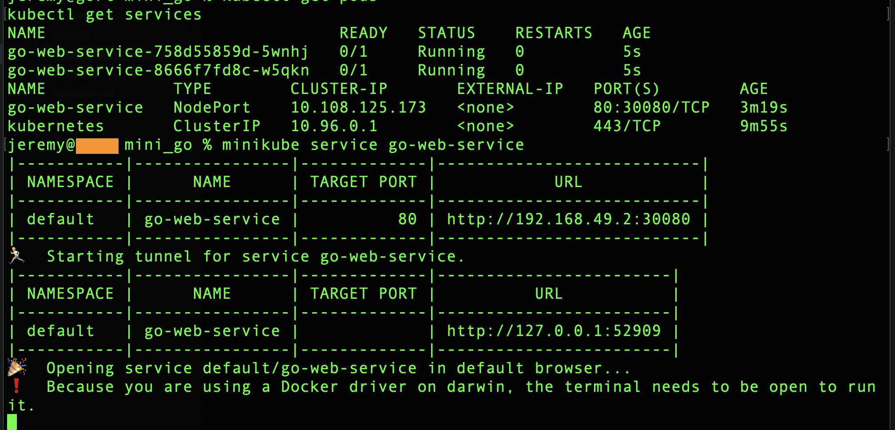
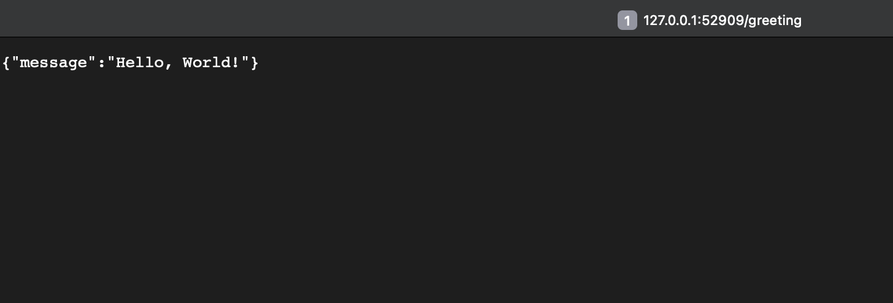

# Go Web Service with Kubernetes Deployment

This project demonstrates a simple Go web service, containerized with Docker, and deployed to a local Kubernetes cluster using Minikube. It serves as a practical example of modern cloud-native application development and deployment practices.





## Project Components

1. Go Web Service: A basic HTTP server with health check and greeting endpoints.
2. Dockerfile: Instructions for building a Docker container for the Go service.
3. Kubernetes Manifests: YAML files defining the Kubernetes Deployment and Service.

## Prerequisites

- Go (1.16 or later)
- Docker
- Minikube
- kubectl

## Setup and Running

### 1. Go Web Service

The `main.go` file contains a simple web service with two endpoints:
- `/health`: Returns "OK" for health checks
- `/greeting`: Returns a JSON response with a greeting message

To run locally:

```sh
go run main.go
```

### 2. Docker Container

Build the Docker image:

```sh
docker build -t go-web-service:v1 .
```

### 3. Minikube Setup

Start Minikube:

```sh
minikube start
```

Configure Docker to use Minikube's Docker daemon:

```sh
eval $(minikube docker-env)
```

### 4. Kubernetes Deployment

Apply the Kubernetes manifests:

```sh
kubectl apply -f kubernetes-manifest.yaml
```

Verify the deployment:

```sh
kubectl get pods
kubectl get services
```

Access the service:

```sh
minikube service go-web-service
```

## Project Structure

```
.
├── main.go
├── Dockerfile
├── kubernetes-manifest.yaml
└── README.md
```

## Contributing

Contributions are welcome! Please feel free to submit a Pull Request.

## License

This project is open source and available under the [GNU AFFERO GENERAL PUBLIC LICENSE](LICENSE).
